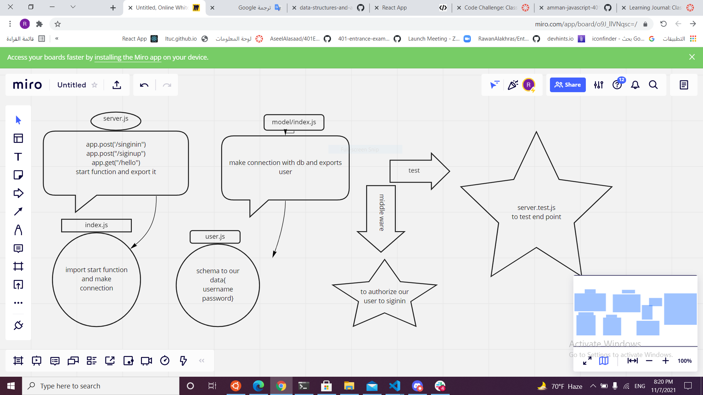

# basic-auth

Author:raneem ABU JAMOUS

## ACTION

https://github.com/raneemabujamous/basic-auth/actions

## Huroko

https://lab06appraneem.herokuapp.com/

## .env

PORT - [3000]
DATABASE_URL=postgres://localhost:5432/lab06
npm start

Endpoint: /signup
Endpoint: /signin
Returns Object
{
"username":"name provided"
},
{
"username":"raneem",
"password":"raneem"

}

## Tests

Unit Tests: npm run test

